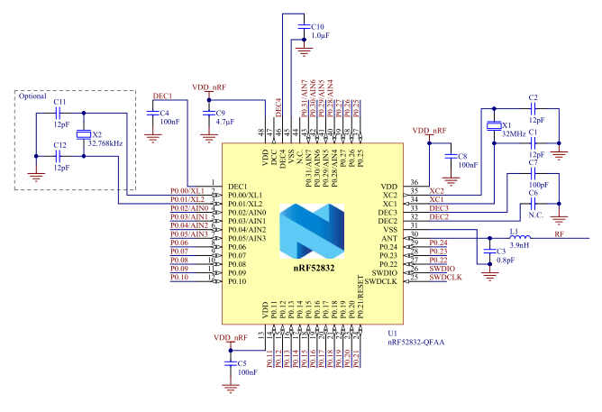

# [nRF52832](https://github.com/SoCXin/nRF52832) 

 

#### [Vendor](https://github.com/SoCXin/Vendor) ：[Nordic](https://github.com/SoCXin/Nordic) 
#### [Core](https://github.com/SoCXin/Cortex) ：[Cortex M4](https://github.com/SoCXin/CM4) 
#### [Level](https://github.com/SoCXin/Level) ：64MHz 

### [nRF52832简介](https://github.com/SoCXin/nRF52832/wiki)

[nRF52832](https://github.com/SoCXin/nRF52832) 是一款超低功耗多协议SoC，嵌入式2.4GHz收发器，支持BLE、ANT和2.4GHz超低功耗应用。

64 MHz的32位 ARM® Cortex™-M4F处理器，64 MHz主频，与竞争者的解决方案相比，提供多出60%的通用处理能力以及十倍浮点和两倍数字信号处理(DSP)性能。nRF52832器件的2.4 GHz多协议无线电完全兼容蓝牙4.2规范，并且具有-96 dB RX 灵敏度和5.5 mA 峰值RX/TX电流。nRF52832 还具有512 kB Flash和64 kB RAM，有400KB的Flash可用于放置开发应用程序，以及优化的全自动功耗管理系统。

nRF52832芯片支持NFC-A，可以作为NFC Tag使用，包括了AES硬件加密，12位ADC，可在1.7V - 3.6V的电源电压下工作。

相比前代产品nRF51822功耗几乎降低了一半，有接近-96dBm的射频接收灵敏度,-30dBm — 4dBm的宽幅输出功率调节。

### [资源收录](https://github.com/SoCXin)

* [文档](docs/)
* [资源](src/)

### [关联资源](https://github.com/SoCXin)

* [开源项目](https://github.com/NordicSemiconductor)
* [官方SDK](https://www.nordicsemi.com/Software-and-Tools/Software/nRF5-SDK)

#### [硬件设计资源](https://github.com/SoCXin/nRF52832)

封装：QFN48 (QFAA 6mm x 6mm) 

### [关联资源](https://github.com/SoCXin)

* [arm-none-eabi编译](https://github.com/SoCXin/arm-none-eabi)

### [选型建议](https://github.com/SoCXin)

[nRF52832](https://github.com/SoCXin/nRF52832)是一款性能非常强大的明星BLE SoC产品，芯片综合实力强大，网络参考资源非常丰富，非常适合应用于原型开发，特别是对NFC tag有需求的产品。同系列更高规格产品还有[nRF52833](https://github.com/SoCXin/nRF52833)、[nRF52840](https://github.com/SoCXin/nRF52840)

[nRF52832](https://github.com/SoCXin/nRF52832)的市场竞争对手为TI SimpleLink系列的[CC2640](https://github.com/SoCXin/CC2640)，Nordic的产品相比TI产品在开发工具和资源策略上不同，Nordic产品的性能更强但TI的低功耗更好。

##  [SoC资源平台](http://www.qitas.cn)  

