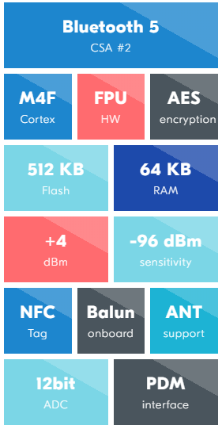
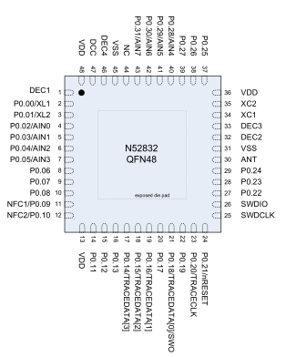

# [nRF52832](https://github.com/sochub/nRF52832) 

 

#### 父级：[Nordic](https://github.com/sochub/Nordic) 

#### 归属：[cortex M4](https://github.com/sochub/CM4) 

### [nRF52832简介](https://github.com/sochub/nRF52832/wiki)

nRF52832 SoC是一款超低功耗多协议SoC，嵌入式2.4GHz收发器，支持BLE、ANT和2.4GHz超低功耗应用。

ARM®Cortex™-M4F内核64 MHz主频，支持DSP指令，内置512KB的Flash+64KB的RAM，将会有400KB的Flash可用于放置开发应用程序。

nRF52832芯片支持NFC-A，可以作为NFC Tag使用，包括了AES硬件加密，12位ADC，可在1.7V - 3.6V的电源电压下工作。

相比前代产品nRF51822功耗几乎降低了一半，有接近-96dBm的射频接收灵敏度,-30dBm — 4dBm的宽幅输出功率调节。

 
 

### [收录资源](https://github.com/sochub/nRF52832)

* [参考文档](docs/)
	* [芯片手册](docs/)
* [参考资源](src/)
* [demo工程](demo/)

官方资源下载 [SDK](https://www.nordicsemi.com/Software-and-Tools/Software/nRF5-SDK)

#### [硬件设计资源](https://github.com/sochub/nRF52832)

封装：QFN48 (QFAA 6mm x 6mm) 

  

* [Eagle资源](src/Eagle)
* [kicad资源](src/kicad)
	* [kicad参考设计](src/kicad/demo)
	* [kicad模型库](src/kicad/libs)

### [选型建议](https://github.com/sochub/nRF52832)

[nRF52832](https://github.com/sochub/nRF52832)是一款性能非常强大的明星BLE SoC产品，芯片综合实力强大，网络参考资源非常丰富，非常适合应用于原型开发，特别是对NFC tag有需求的产品。

[nRF52832](https://github.com/sochub/nRF52832)的市场竞争对手为TI SimpleLink系列的[CC2640](https://github.com/sochub/CC2640)，Nordic的产品相比TI产品在开发工具和资源策略上不同，Nordic产品的性能更强但TI的低功耗更好。

对于片上资源升级替换方案，或则需要支持Zigbee等更多无线协议可选[nRF52840](https://github.com/sochub/nRF52840)或[CC2650](https://github.com/sochub/CC2650)，当然新入局的国产WCH的[CH579](https://github.com/sochub/CH579)也可以考虑下。

##  [SoC资源平台](http://www.qitas.cn)  

